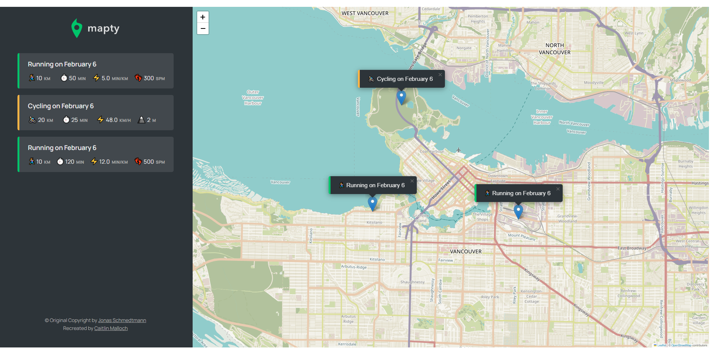
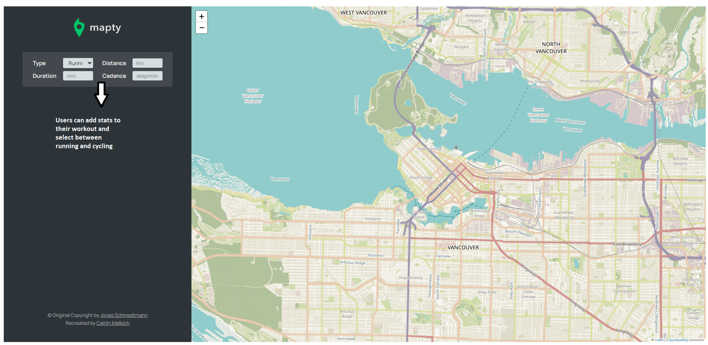

# Mapty

This web application uses geolocation to track workouts, allowing a user to save the distance and other stats from their workout in the application.

## Features

- Geolocation to display the map at current location
- Map where user clicks to add new workout
- Form to input distance, time, pace, steps/minute
- Form to input distance, time, speed, elevation gain
- Display workouts in a list
- Display workouts on the map
- Store workout data in the browser
- On page load, read the saved data and display

## Live Site

[Link](https://mapty-caitlin-malloch.netlify.app)

Currently hosted by Netlify

## Tech Stack

- HTML
- CSS
- JavaScript
  - (Leaflet library) for interactive map: [https://leafletjs.com/]

## UI Preview

Users can place their workout data on the map and a marker will be placed to show where the workout occured and will hold the stats in place.

There are several fields of workout stats that can be entered by the user, depending on the workout type.

## Build Specs

This is a final overview of the arhitecture of the Mapty application. The learning objective for this project is using OOP with JavaScript and becoming familiar with class polymorphism.

This is the flowchart used in design to build features.

## Developer

Caitlin Malloch

## License

MIT License

Copyright (c) 2023 Caitlin Malloch

Permission is hereby granted, free of charge, to any person obtaining a copy of this software and associated documentation files (the "Software"), to deal in the Software without restriction, including without limitation the rights to use, copy, modify, merge, publish, distribute, sublicense, and/or sell copies of the Software, and to permit persons to whom the Software is furnished to do so, subject to the following conditions:

The above copyright notice and this permission notice shall be included in all copies or substantial portions of the Software.

THE SOFTWARE IS PROVIDED "AS IS", WITHOUT WARRANTY OF ANY KIND, EXPRESS OR IMPLIED, INCLUDING BUT NOT LIMITED TO THE WARRANTIES OF MERCHANTABILITY, FITNESS FOR A PARTICULAR PURPOSE AND NONINFRINGEMENT. IN NO EVENT SHALL THE AUTHORS OR COPYRIGHT HOLDERS BE LIABLE FOR ANY CLAIM, DAMAGES OR OTHER LIABILITY, WHETHER IN AN ACTION OF CONTRACT, TORT OR OTHERWISE, ARISING FROM, OUT OF OR IN CONNECTION WITH THE SOFTWARE OR THE USE OR OTHER DEALINGS IN THE SOFTWARE.

## Acknowledgements

The Complete JavaScript Course 2023: From Zero to Expert!, Udemy
Jonas Schmedtmann
